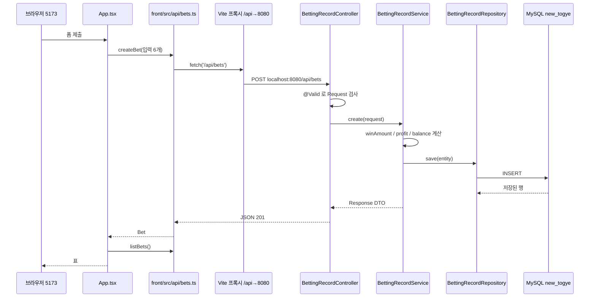
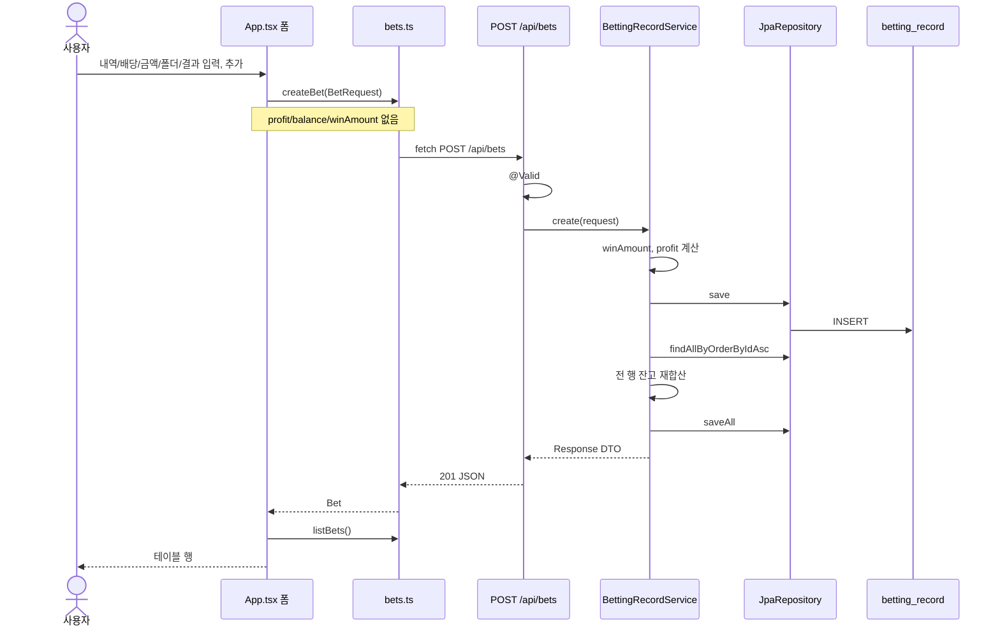

# togye 1차 작업 가이드

Spring Boot REST API + React로 배팅 원장을 만드는 초보자용 학습 노트

| 항목 | 값 |
|---|---|
| 문서 제목 | togye 1차 작업 가이드: Entity부터 React 목록 화면까지 |
| 대상 제품 | togye — Excel `1억_환수.xlsx` (시트 `No.1~1000`)를 대체하는 개인 배팅 원장 |
| 날짜 | 2026-08-20 |
| 상태 | Draft |
| 대상 독자 | Spring Boot + React + TypeScript가 처음인 개발자. **이 문서를 보고 직접 타이핑한다.** |
| 이 문서의 성격 | 구현 대행이 아니다. 저장소 Java/TS를 이 문서가 대신 고치지 않는다. 레이어 순서대로 손으로 작성하는 가이드다. |

각 레이어마다 같은 순서로 설명한다.

1. 이 파일이 왜 필요한지
2. 해도 되는 일 / 하면 안 되는 일
3. 주석이 많은 예시 코드 (한 줄씩 읽을 수 있게)
4. 그 레이어만 확인하는 방법
5. 초보자가 자주 빠지는 함정

작업 순서는 고정이다. 건너뛰면 “누가 JSON을 만드는지”가 섞인다.

**entity → Repository → DTO → service → Controller → JSON API → frontend (types → api → pages)**

예시 코드의 필드명은 **현재 엔티티와 같다.** 결과 필드는 `result`가 아니라 `betResult`다. DTO는 `class`다. `record`를 쓰지 않는다. 필드 선언은 세미콜론, `new Foo(a, b)` 인자만 콤마다.

---

## 1. 큰 그림

엑셀을 웹앱으로 옮기는 일이지만, **지금 엔티티가 기준**이다. 엑셀의 합계 열, 보너스 열, 입출금 시트에 맞춰 테이블을 다시 그리지 않는다. 1차에서 만드는 것은 단 하나다.

> 배팅 한 줄을 만들고, 목록으로 보고, 고치고, 지운다.

백엔드는 Spring Boot REST API, 프론트는 `front/` 안의 Vite + React + TypeScript다. **프로세스 두 개**다. 브라우저가 보는 주소와 API 주소가 다르다.

| 프로세스 | 위치 | 포트 | 하는 일 |
|---|---|---|---|
| Spring Boot | 프로젝트 루트 `./gradlew bootRun` | 8080 | JSON API, DB 저장 |
| Vite | `front/`에서 `npm run dev` | 5173 | 화면. 저장은 하지 않음 |

이미 있는 것 (읽을 때 기준으로 삼을 것):

- Spring Boot **4.1.0**, Gradle **9.5.1**, Java toolchain **26** (`build.gradle`)
- 패키지: `com.yama331.togye`
- JPA + WebMVC + Lombok + MySQL. Security는 주석 처리됨
- 엔티티: `BettingRecord`, `BetResult`. 결과 필드 이름은 `betResult`
- DB: `jdbc:mysql://localhost:3306/new_togye`, `ddl-auto=update`
- `TestController`의 `GET /hi` → `"hi"` (서버가 살아 있는지 확인용. 지우지 말 것)
- `front/`는 Vite 기본 템플릿

학습 중에 Entity / Repository / DTO를 이미 만들었을 수 있다. 이미 있는 파일은 **다시 만들지 말고**, 이 문서의 설명과 주석을 기준으로 스스로 맞는지 대조한다. 다음 레이어(Service)로 넘어가기 전에 그 대조를 끝낸다.

### 1.1 파일이 많은 이유

한 요청을 처리하려면 역할이 여러 겹이다. 한 클래스에 몰아넣으면 처음엔 짧아 보이지만, 계산·검증·URL이 한곳에 섞여 고치기 어려워진다.

| 역할 | 파일 | 한 줄 의미 |
|---|---|---|
| 테이블 한 행의 모양 | `entity/BettingRecord.java` | DB 컬럼 = Java 필드 |
| 결과 값 목록 | `entity/BetResult.java` | HIT/MISS/PUSH/PENDING. 테이블 아님 |
| DB 조회 | `repository/BettingRecordRepository.java` | “가져와, 저장해, 지워” |
| 들어오는 JSON | `dto/BettingRecordRequest.java` | 클라이언트가 보내도 되는 입력만 |
| 나가는 JSON | `dto/BettingRecordResponse.java` | 화면에 줄 필드만 |
| 계산 | `service/BettingRecordService.java` | 적중금액·수익·잔고. 엑셀 수식 |
| URL | `controller/BettingRecordController.java` | `/api/bets`와 HTTP 메서드 |
| 화면 타입 | `front/src/types/bet.ts` | JSON 모양을 TypeScript로 |
| HTTP 호출 | `front/src/api/bets.ts` | `fetch`. URL을 페이지에 안 흩뿌림 |
| 화면 | `front/src/App.tsx` | 표 + 폼 |

기억할 한 줄:

> Entity는 행의 모양만 안다. 조회는 Repository, 계산은 Service, URL은 Controller, 화면은 React다.

### 1.2 요청이 한 바퀴 도는 길

브라우저에서 “추가”를 누르면 데이터가 이렇게 움직인다.



JSON이 오가는 지점은 **Controller ↔ 브라우저**다. Entity(테이블 객체)를 브라우저에 그대로 보내지 않는다. 이유:

1. 클라이언트가 `profit`을 마음대로 넣을 수 있다.
2. 나중에 내부 필드가 엔티티에 붙으면 JSON으로 새어 나간다.
3. DB 컬럼명(`bet_result`)과 화면 키(`betResult`)를 나눌 수 있다.

### 1.3 두 터미널로 실행하는 법

**터미널 1 — API (프로젝트 루트)**

```bash
cd /Users/jun_jehyun/Desktop/JJH/01.Project/00.New_Togye/togye
./gradlew bootRun
```

기동이 끝나면 브라우저나 터미널에서 `http://localhost:8080/hi` 를 연다. `"hi"`가 나와야 한다. 이게 안 되면 프론트 문제가 아니라 서버가 안 켜진 것이다.

**터미널 2 — 프론트**

```bash
cd /Users/jun_jehyun/Desktop/JJH/01.Project/00.New_Togye/togye/front
npm run dev
```

`http://localhost:5173` 이다. 아직 목록을 안 만들었으면 Vite 기본 카운터 화면이다.

MySQL은 미리 켜 둔다. **데이터베이스 `new_togye`는 직접 만든다.** Hibernate `ddl-auto=update`는 *테이블*만 맞춘다. DB 이름 자체는 만들어 주지 않는다.

```sql
CREATE DATABASE IF NOT EXISTS new_togye
  CHARACTER SET utf8mb4
  COLLATE utf8mb4_unicode_ci;
```

이 줄 없이 `bootRun`하면 로그에 `Unknown database 'new_togye'`가 난다. 앱 코드가 틀린 게 아니라 DB가 없는 것이다.

`src/main/resources/application.properties`가 그 DB를 본다.

```
spring.datasource.url=jdbc:mysql://localhost:3306/new_togye?...
spring.datasource.username=root
spring.datasource.password=1234
spring.jpa.hibernate.ddl-auto=update
```

앱이 켜질 때 테이블이 없으면 만들고, 컬럼이 모자라면 추가한다. 마이그레이션 파일을 따로 치지 않는다. 로컬 학습용이다. 컬럼을 지우거나 이름을 바꾸는 일은 1차에서 하지 않는다.

### 1.4 Vite 프록시 — 브라우저가 8080을 직접 치지 않게

브라우저 보안 때문에, `localhost:5173` 페이지가 `localhost:8080`을 `fetch`하면 CORS 에러가 난다. 포트가 다르면 “다른 사이트”로 본다.

1차는 CORS 설정을 Spring에 넣지 않는다. 대신 Vite가 `/api`로 오는 요청을 8080으로 **대신** 전달한다.

프론트 코드는 항상 이렇게만 호출한다.

```ts
fetch('/api/bets')  // 5173 기준 상대 경로. 절대 URL http://localhost:8080 을 쓰지 말 것
```

브라우저 입장에서는 같은 5173이라 CORS가 안 뜬다. Vite가 뒤에서 8080으로 넘긴다.

`front/vite.config.ts`에 프록시를 넣는 시점은 **프론트 api 레이어(G2)** 다. 지금 없으면 정상이다. 백엔드를 curl로 먼저 증명한 뒤에 넣는다.

프록시를 빼먹거나 Vite를 재시작하지 않으면, 5173의 `/api/bets`가 React HTML을 돌려준다. API가 죽은 게 아니라 경로가 프론트 서버에 떨어진 것이다.

Security는 `build.gradle`에서 주석이다. 1차 `/api/bets`는 로그인 없이 열린다. 401을 기대하지 말 것.

---

## 2. 이번에 만들 한 조각

머릿속에 넣을 그림은 이것뿐이다.

> 배팅 한 줄을 CRUD하고, 엑셀 열 모양의 표로 본다.

엑셀 첫 시트의 **데이터 행**이다. 위쪽 환수율·적중률·연승은 엑셀이 계산한 숫자이지 DB 컬럼이 아니다. 입출금 시트도 이번 엔티티에 없다.

| 포함 (1차) | 제외 (나중) |
|---|---|
| `BettingRecord` CRUD | 환수율 / 적중률 / 연승 대시보드 |
| 목록 테이블 (순번~잔고) | `GET /api/bets/stats` |
| 서버에서 profit / balance / winAmount 계산 | 입출금 엔티티 |
| Vite 프록시 + React 한 페이지 | Excel 파일 import |
| | 로그인 |
| | Next.js, 서버 HTML 템플릿 |

한 조각을 끝까지 관통하면, 통계는 나중에 “Service에 집계 하나 + 화면 상단 숫자”로 얹으면 된다. 지금 통계부터 만들면 레이어를 배우기 전에 산으로 간다.

---

## 3. 레이어별 수업

아래는 **타이핑 순서**다. A를 이해하기 전에 B로 가지 말 것.

---

### A. Entity — 테이블 한 행을 Java로 선언하는 곳

#### 이 파일이 존재하는 이유

MySQL 테이블 `betting_record`의 한 줄이 Java 객체로 어떻게 생겼는지 알려 준다. Hibernate(JPA)는 이 선언을 읽고 `CREATE TABLE` / `INSERT` SQL을 만든다.

Entity는 **조회 메서드를 넣지 않는다.** “전부 가져와”는 다음 파일(Repository)이다.

경로 (이미 있음. 새로 만들지 말 것):

- `src/main/java/com/yama331/togye/entity/BettingRecord.java`
- `src/main/java/com/yama331/togye/entity/BetResult.java`

#### 해도 되는 일 / 하면 안 되는 일

| 해도 됨 | 하면 안 됨 |
|---|---|
| 이미 있는 필드·훅의 **의미를 읽기** | 엑셀 합계·보너스 컬럼을 필드로 추가 |
| 주석을 더 친절하게 다듬기 | profit / balance / winAmount를 “계산되니 빼자”며 컬럼 삭제 |
| | 입출금 엔티티를 이 단계에서 만들기 |
| | Entity를 Controller에서 JSON으로 반환하기 |

**결정:** 현재 엔티티가 진실의 원천이다. 엑셀 수식에 맞추려 엔티티를 바꾸지 않는다.

#### 엑셀 열 vs 현재 엔티티 (참고. 바꾸라는 뜻이 아님)

엑셀 시트 `No.1~1000` 열:

`순번 | 날짜 | 내역 | 배당 | 배팅금액 | 폴더수 | 적중금액 | 적중유무 | 수익 | 잔고 | 합계 | 보너스`

| 엑셀 | 엔티티 필드 | 비고 |
|---|---|---|
| 순번 | `id` | AUTO_INCREMENT. 엑셀 행 번호와 숫자가 꼭 같지는 않음 |
| 날짜 | `betDate` | null 허용. 엑셀은 빈 칸이면 위 날짜를 눈으로 이어 봄 |
| 내역 | `description` | TEXT, 필수 |
| 배당 | `odds` | `BigDecimal` 소수 4자리 |
| 배팅금액 | `betAmount` | `BigDecimal` 소수 2자리 |
| 폴더수 | `folderCount` | Integer |
| 적중금액 | `winAmount` | null 허용. 낙첨/적특은 0, 대기는 null |
| 적중유무 | `betResult` | HIT / MISS / PUSH / PENDING |
| 수익 | `profit` | **저장 컬럼.** 클라이언트가 안 보냄. 서버가 계산 |
| 잔고 | `balance` | **저장 컬럼.** 위와 같음 |
| 합계 | (없음) | 1차에서 안 만듦 |
| 보너스 | (없음) | 1차에서 안 만듦 |
| (엑셀에 없음) | `createdAt` / `updatedAt` | 앱이 넣는 시각 |

환수율·적중률·연승은 **저장하지 않는다.** 나중에 목록을 보고 계산하면 된다.

#### `BetResult.java` — 결과 네 가지

테이블이 아니다. `@Entity`가 없다. `bet_result`라는 별도 테이블은 생기지 않는다.

```java
package com.yama331.togye.entity;

/**
 * 한 줄의 배팅 결과. 이 네 값만 허용한다.
 *
 * HIT     : 적중. 배당 × 금액이 환급되고, 수익은 (환급 - 배팅금)
 * MISS    : 미적중. 환급 0, 수익은 -배팅금
 * PUSH    : 적중특례(본전). 환급 0으로 두고 수익 0 (엔티티 주석 기준)
 * PENDING : 아직 경기 전/결과 대기. 환급은 모름(null), 수익 0, 잔고는 안 깎음
 *
 * DB에는 숫자(0,1,2,3)가 아니라 문자열 "HIT" 로 저장한다.
 * 숫자를 쓰면 나중에 enum 순서를 바꾸면 옛 데이터가 엉킨다.
 */
public enum BetResult {
    HIT,
    MISS,
    PUSH,
    PENDING
}
```

`BettingRecord`가 이 타입을 필드로 들고, `@Enumerated(EnumType.STRING)` 때문에 컬럼에는 `"HIT"`가 들어간다.

#### `BettingRecord.java` — 한 줄씩

돈은 반드시 `BigDecimal`이다. `double` / `float`는 1.1 + 2.2가 3.3이 안 되는 그 문제다.

클래스 선언이 의미하는 것:

```java
@Entity                          // "이 클래스는 DB 테이블 한 행이다"
@Table(name = "betting_record")  // 테이블 이름. 안 쓰면 클래스명 규칙으로 바뀜
@Getter                          // Lombok이 getId(), getOdds() 등을 컴파일 때 생성
@Setter                          // setId(), setOdds() ...
@NoArgsConstructor               // new BettingRecord() — JPA가 빈 객체를 만든 뒤 필드를 채움
@AllArgsConstructor              // 모든 필드를 받는 생성자 (테스트·빌더 보조)
@Builder                         // BettingRecord.builder().odds(...).build()
public class BettingRecord {
```

Lombok `@Getter`가 있으면 소스에 `getBetResult()`를 직접 안 짜도 된다. 필드 이름이 `betResult`이면 getter는 `getBetResult()`다. `getResult()`가 아니다. Service/DTO에서 이름을 맞춰야 컴파일된다.

순번:

```java
    @Id  // 기본키
    @GeneratedValue(strategy = GenerationType.IDENTITY)  // MySQL AUTO_INCREMENT
    private Long id;  // 클라이언트가 만들지 않는다. INSERT 후 DB가 채워 준다
```

날짜:

```java
    // LocalDate = 시각 없는 날짜. JSON에서는 "2026-08-20"
    // nullable = true → 엑셀처럼 날짜 칸이 비어 있어도 된다
    @Column(name = "bet_date", nullable = true)
    private LocalDate betDate;
```

`java.util.Date`는 쓰지 않는다. 구식이고 시간대 실수가 많다.

내역:

```java
    // TEXT라서 긴 경기 설명도 된다. nullable = false → 빈 설명으로 INSERT 하면 DB가 거절
    @Column(name = "description", nullable = false, columnDefinition = "TEXT")
    private String description;
```

배당 / 금액 / 폴더:

```java
    // precision 10, scale 4 = 정수 최대 6자리 + 소수 4자리. 예: 2.1500
    @Column(name = "odds", nullable = false, precision = 10, scale = 4)
    private BigDecimal odds;

    // 금액은 원 단위 가계부. 소수 2자리
    @Column(name = "bet_amount", nullable = false, precision = 15, scale = 2)
    private BigDecimal betAmount;

    @Column(name = "folder_count", nullable = false)
    private Integer folderCount;
```

적중 금액:

```java
    // nullable을 안 적으면 기본은 null 허용
    // HIT → 배당×금액, MISS/PUSH → 0, PENDING → null (아직 모름)
    @Column(name = "win_amount", precision = 15, scale = 2)
    private BigDecimal winAmount;
```

이 값은 클라이언트가 보내지 않는다. Service가 채운다.

결과:

```java
    // Java 필드: betResult
    // DB 컬럼: bet_result
    // JSON: betResult (DTO 필드 이름을 그대로 씀)
    @Enumerated(EnumType.STRING)  // DB에 "HIT" 문자열. 숫자 0/1 금지
    @Column(name = "bet_result", nullable = false, length = 20)
    private BetResult betResult;
```

수익 / 잔고도 **저장한다.** “계산 가능하니까 빼자”는 1차에서 하지 않는다. 엑셀도 각 행에 적어 두었다. 화면은 읽기만 한다.

```java
    @Column(name = "profit", nullable = false, precision = 15, scale = 2)
    private BigDecimal profit;

    @Column(name = "balance", nullable = false, precision = 15, scale = 2)
    private BigDecimal balance;
```

생성/수정 시각:

```java
    // updatable = false → UPDATE SQL에 created_at을 넣지 않는다. 최초 INSERT 값 유지
    @Column(name = "created_at", nullable = false, updatable = false)
    private LocalDateTime createdAt;

    // INSERT 직후에는 null. 한 번도 수정 안 한 행을 JSON에서 구분하려고
    @Column(name = "updated_at")
    private LocalDateTime updatedAt;
```

`created_at`은 NOT NULL이다. 훅이 없으면 첫 `save()`가 실패한다.

#### `@PrePersist` / `@PreUpdate` — INSERT/UPDATE 직전 자동 시각

엔티티를 재설계하는 것이 아니다. 시각을 Service에서 매번 `setCreatedAt` 하면 빼먹기 쉽다. 엔티티가 스스로 넣는다.

1차 규칙:

- INSERT (`@PrePersist`): `createdAt`만 now. **`updatedAt`은 null로 둔다.**
- UPDATE (`@PreUpdate`): 그때 `updatedAt`을 채운다.

방금 만든 행의 JSON은 `"updatedAt": null`이다. 버그가 아니다.

```java
    // INSERT 직전에 JPA가 호출한다. Service에서 호출하지 않아도 된다.
    @PrePersist
    protected void onCreate() {
        // 테스트에서 미리 넣었으면 덮어쓰지 않는다
        if (this.createdAt == null) {
            this.createdAt = LocalDateTime.now();
        }
        // updatedAt은 여기서 넣지 않는다. 새 행은 null
    }

    // UPDATE 직전에 호출된다. INSERT에는 호출되지 않는다.
    @PreUpdate
    protected void onUpdate() {
        this.updatedAt = LocalDateTime.now();
    }
```

이미 클래스 안에 있다면 다시 넣지 말고, 위 규칙과 같은지만 확인한다.

#### `ddl-auto=update` 의미

```
spring.jpa.hibernate.ddl-auto=update
```

필드를 추가하고 앱을 재시작하면 Hibernate가 `ALTER TABLE`을 시도한다. 로컬 1차는 이걸로 충분하다.

| 좋음 | 위험 |
|---|---|
| 마이그레이션 파일 없이 로컬 개발이 빠름 | 컬럼을 줄이거나 이름을 바꾸면 옛 데이터가 남을 수 있음 |
| | 프로덕션에서 `update`는 쓰지 말 것. 나중에 `validate` 또는 마이그레이션 도구 |

1차에서는 필드를 삭제하지 않는다.

#### 이 레이어만 확인하는 방법

1. `./gradlew bootRun`이 에러 없이 기동되는가.
2. MySQL에서 테이블이 생겼는가.

```sql
USE new_togye;
DESC betting_record;
```

기대 컬럼: `id`, `bet_date`, `description`, `odds`, `bet_amount`, `folder_count`, `win_amount`, `bet_result`, `profit`, `balance`, `created_at`, `updated_at`.

아직 Repository가 없어도 테이블이 보이면 Entity 레이어는 통과다. 이미 통과했다면 다음으로 간다.

#### 초보자가 자주 빠지는 함정

- Entity에 `findAllHit()` 같은 조회를 넣고 싶어짐 → Repository 이름이다.
- profit을 클라이언트가 보내게 필드를 “입력”으로 생각함 → 서버 계산. Request DTO에 넣지 말 것.
- enum을 DB에 숫자로 저장 (`ORDINAL`) → 순서만 바뀌어도 데이터가 깨진다. 이미 STRING이다.
- `@PrePersist`에서 `updatedAt`까지 채움 → 1차는 null이 의도다.
- getter를 `getResult()`로 부름 → 필드가 `betResult`이면 `getBetResult()`다.

---

### B. Repository — “가져와, 저장해”를 선언만 하는 곳

#### 이 파일이 존재하는 이유

Entity는 행의 모양만 안다. “id 오름차순으로 전부 가져와”는 Entity의 일이 아니다. 조회를 이 파일에 모은다.

Spring Data는 **인터페이스만** 만들면 된다. 클래스 본문에 SQL을 직접 안 짠다. 메서드 **이름**을 파싱해서 구현체를 런타임에 만든다.

경로:

`src/main/java/com/yama331/togye/repository/BettingRecordRepository.java`

#### 해도 되는 일 / 하면 안 되는 일

| 해도 됨 | 하면 안 됨 |
|---|---|
| `interface` + `JpaRepository<BettingRecord, Long>` | `class`로 만들고 SQL을 직접 작성 (1차 불필요) |
| 메서드 이름으로 정렬·필터 | Controller에서 DB를 직접 치기 |
| | profit/balance 계산 (그건 Service) |

#### 예시 (주석을 읽고 타이핑)

```java
package com.yama331.togye.repository;

import com.yama331.togye.entity.BetResult;
import com.yama331.togye.entity.BettingRecord;
import org.springframework.data.jpa.repository.JpaRepository;

import java.time.LocalDate;
import java.util.List;

/**
 * DB 접근 창구.
 *
 * JpaRepository를 상속하면 아래 메서드는 안 적어도 생긴다.
 *   findAll()          전체
 *   findById(id)       단건. 없으면 빈 Optional
 *   save(entity)       id가 없으면 INSERT, 있으면 UPDATE
 *   deleteById(id)     삭제
 *   count()
 *   existsById(id)
 *
 * 우리가 추가로 적는 메서드는 "이름 = SQL" 이다. 중괄호 본문이 없다.
 */
public interface BettingRecordRepository extends JpaRepository<BettingRecord, Long> {

    /**
     * 1차가 실제로 부르는 메서드.
     * 목록과 잔고 재계산 둘 다 "엑셀처럼 위에서 아래로" = id 오름차순.
     * 날짜순이 아니다. 날짜가 null인 행이 섞여 있다.
     */
    List<BettingRecord> findAllByOrderByIdAsc();

    // 아래는 이름 연습용. Service에서 안 불러도 컴파일된다. 헷갈리면 지워도 된다.
    List<BettingRecord> findAllByOrderByIdDesc();

    // Java 필드명 betDate → WHERE bet_date = ?
    List<BettingRecord> findByBetDate(LocalDate betDate);

    // Java 필드명 betResult → WHERE bet_result = ?
    // findByResult 가 아니다. 필드가 result가 아니기 때문이다.
    List<BettingRecord> findByBetResult(BetResult betResult);
}
```

`JpaRepository<BettingRecord, Long>` 의 두 인자:

- 첫 번째: 엔티티 타입
- 두 번째: PK 타입. `Long id`

이름 규칙:

- `findBy` + **Java 필드명** (`betDate`, `betResult`). DB 컬럼명 `bet_date`를 쓰면 실패한다.
- `OrderBy` + 필드 + `Asc` / `Desc`
- `And` / `Or`로 이어 붙이기 가능

`@Query("SELECT ...")`는 1차에서 필요 없다. JOIN이 아직 없다.

잔고 재계산은 **반드시 id 오름차순**이다. 최신 글이 위로 오는 블로그 목록이 아니다.

#### 이 레이어만 확인하는 방법

테스트가 부담이면 컴파일만으로 통과해도 된다.

```bash
./gradlew compileJava
```

인터페이스는 구현 클래스가 없어도 컴파일된다. 앱 기동 때 Spring이 구현체를 만든다.

저장까지 보고 싶으면 테스트 클래스 예시:

```java
package com.yama331.togye.repository;

import com.yama331.togye.entity.BetResult;
import com.yama331.togye.entity.BettingRecord;
import org.junit.jupiter.api.Test;
import org.springframework.beans.factory.annotation.Autowired;
import org.springframework.boot.test.context.SpringBootTest;

import java.math.BigDecimal;

import static org.junit.jupiter.api.Assertions.assertNotNull;

@SpringBootTest  // 실제 앱 + 실제 new_togye 를 켠다. H2가 이 프로젝트에 없다
class BettingRecordRepositoryTest {

    // Service/Controller에서는 필드 @Autowired 를 쓰지 않는다 (생성자 주입).
    // 테스트 클래스만 필드 주입이 흔하다.
    @Autowired
    BettingRecordRepository repository;

    @Test
    void saveAndFind() {
        BettingRecord row = BettingRecord.builder()
                .description("레이어 테스트")
                .odds(new BigDecimal("1.9000"))
                .betAmount(new BigDecimal("10000.00"))
                .folderCount(1)
                .betResult(BetResult.PENDING)  // setResult 아님
                .profit(BigDecimal.ZERO)       // NOT NULL 이라 테스트에서도 채운다
                .balance(BigDecimal.ZERO)
                .build();
        // createdAt은 @PrePersist가 INSERT 직전에 넣는다. 여기서 안 넣어도 된다.
        BettingRecord saved = repository.save(row);
        assertNotNull(saved.getId());
        repository.deleteById(saved.getId());  // 테스트 행을 남기지 않음
    }
}
```

```bash
./gradlew test --tests com.yama331.togye.repository.BettingRecordRepositoryTest
```

`@PrePersist`가 없는 상태에서 이 테스트를 돌리면 `created_at` NOT NULL 때문에 실패한다. 그래서 순서가 Entity 훅 → Repository다.

#### 초보자가 자주 빠지는 함정

- `class BettingRecordRepository`로 만들고 `{ return findAll(); }`를 짬 → **interface**, 본문 없음.
- `findByBet_date`처럼 DB 컬럼명으로 씀 → `betDate`.
- `findByResult` → 필드가 `betResult`이면 `findByBetResult`.
- Repository에 `if (HIT) profit = ...` → 비즈니스 규칙은 Service.
- `findById(id).get()`만 호출 → 없으면 예외. 다음 레이어에서 없으면 404로 바꾼다.

---

### C. DTO — 들어오는 JSON과 나가는 JSON을 엔티티와 분리

#### 이 파일이 존재하는 이유

Entity를 JSON으로 그대로 내보내면:

1. 클라이언트가 `profit`, `balance`, `winAmount`를 보낼 수 있다. 원장이 조작된다.
2. 나중에 내부 필드가 엔티티에 붙으면 같이 유출된다.
3. DB 컬럼과 화면 키를 나누기 어렵다.

그래서 **입력 가방**과 **출력 가방**을 따로 둔다.

| 파일 | 방향 | 넣는 것 |
|---|---|---|
| `BettingRecordRequest` | 클라이언트 → 서버 | 날짜, 내역, 배당, 배팅금, 폴더수, 결과 |
| `BettingRecordResponse` | 서버 → 클라이언트 | 표에 필요한 전부 + 시각. 계산된 값 포함 |

Request에 없는 것: `id`, `winAmount`, `profit`, `balance`, `createdAt`, `updatedAt`.  
필드가 없으면 JSON에 넣어도 **무시**된다. 그래도 프론트에서 보내지 말 것.

경로:

- `src/main/java/com/yama331/togye/dto/BettingRecordRequest.java`
- `src/main/java/com/yama331/togye/dto/BettingRecordResponse.java`

#### 해도 되는 일 / 하면 안 되는 일

| 해도 됨 | 하면 안 됨 |
|---|---|
| 입력 6개만 Request | Request에 id/profit/balance/winAmount |
| 화면 열을 Response에 | Entity를 상속한 DTO |
| Request에만 `@NotNull` | Response에 `@NotNull` (나가는 값을 입력 검증하지 않음) |
| | DTO 안에서 DB 조회 |

#### class, 세미콜론, 콤마

이 프로젝트는 **class**다. 엔티티와 같은 모양이다.

```java
// 필드 선언 = 문장 → 세미콜론
private String description;
private BigDecimal odds;

// new 의 인자 목록 = 파라미터 → 콤마 (필드가 아니다)
return new BettingRecordResponse(id, betDate, description, ...);
```

`public record Foo(A a, B b) {}` 형태는 쓰지 않는다. 괄호 안 콤마는 생성자 파라미터라서, 필드 선언과 헷갈린다.

#### `@NotNull`은 Request에만

검증은 **들어오는 JSON**만 한다.

| | Request | Response |
|---|---|---|
| 방향 | 클라이언트 → 서버 | 서버 → 클라이언트 |
| `@NotNull` / `@NotBlank` | 붙인다 | 붙이지 않는다 |

import는 반드시 이것이다.

```java
import jakarta.validation.constraints.NotNull;
```

IDE가 `org.antlr.v4.runtime.misc.NotNull`을 고르면 어노테이션이 있어도 검증이 안 돈다. 빨간 줄이 없어도 동작하지 않는다. import 줄을 눈으로 확인한다.

#### 의존성 — validation 스타터

`@Valid` / `@NotNull`이 동작하려면 `build.gradle`에 이 한 줄이 있어야 한다. webmvc만으로는 부족하다.

```gradle
implementation 'org.springframework.boot:spring-boot-starter-validation'
```

빼먹으면 `@Valid`가 무시되거나 기동/요청 때 실패한다. 이미 넣었다면 중복으로 넣지 말 것.

#### Request 예시

클라이언트가 보내도 되는 것: 날짜, 내역, 배당, 배팅금액, 폴더수, 결과.  
create와 update가 **같은 Request**다. 1차 필드가 같다. PATCH는 없다.

```java
package com.yama331.togye.dto;

import com.yama331.togye.entity.BetResult;
import jakarta.validation.constraints.DecimalMin;
import jakarta.validation.constraints.Min;
import jakarta.validation.constraints.NotBlank;
import jakarta.validation.constraints.NotNull;
import lombok.Getter;
import lombok.NoArgsConstructor;
import lombok.Setter;

import java.math.BigDecimal;
import java.time.LocalDate;

/**
 * 클라이언트가 POST/PUT 바디로 보내는 입력.
 *
 * Jackson이 JSON 키와 필드 이름을 맞춰 값을 넣는다.
 *   {"description":"...", "odds":1.9, "betResult":"HIT"}
 *
 * Lombok @Setter 가 있어야 JSON → 객체 변환이 된다 (빈 생성자 + setter).
 * @Getter 는 Service가 request.getOdds() 로 읽게 한다.
 *
 * class 필드이므로 한 줄은 세미콜론으로 끝난다.
 */
@Getter
@Setter
@NoArgsConstructor  // Jackson이 new BettingRecordRequest() 후 setter 호출
public class BettingRecordRequest {

    // 어노테이션 없음 = null 허용. 엑셀의 빈 날짜
    private LocalDate betDate;

    // 빈 문자열 "" 도 거절. @NotNull만 있으면 "" 은 통과한다
    @NotBlank
    private String description;

    // 배당 1.0 미만(0.5 등) 거절
    @NotNull
    @DecimalMin("1.0")
    private BigDecimal odds;

    // 0원 배팅 거절. 폼 초기값을 0으로 두면 첫 추가가 400이다
    @NotNull
    @DecimalMin("0.01")
    private BigDecimal betAmount;

    @NotNull
    @Min(1)
    private Integer folderCount;

    // JSON 키는 "betResult". "result" 로 보내면 이 필드가 null → @NotNull 400
    // "WIN" 처럼 enum에 없는 값이면 @Valid 전에 JSON 파싱이 400 (errors 배열 없음)
    @NotNull
    private BetResult betResult;
}
```

JSON 키는 Java 필드와 같다. **camelCase.** `bet_amount`가 아니다.

#### Response 예시

화면 표 + 시각. `from`은 **클래스 중괄호 안**에 둔다. 파일 맨 아래 `}` 밖에 두면 컴파일이 깨진다.

Response에는 `@NotNull`이 없다. 서버가 채워서 보내는 값이다.

```java
package com.yama331.togye.dto;

import com.yama331.togye.entity.BetResult;
import com.yama331.togye.entity.BettingRecord;
import lombok.AllArgsConstructor;
import lombok.Getter;

import java.math.BigDecimal;
import java.time.LocalDate;
import java.time.LocalDateTime;

/**
 * 클라이언트로 나가는 한 행.
 * Entity를 그대로 노출하지 않고, 화면이 필요한 필드만 담는다.
 *
 * @Getter 만 있다. 나가는 객체라 setter가 필요 없다.
 * @AllArgsConstructor 가 있어야 new BettingRecordResponse(...) 가 컴파일된다.
 */
@Getter
@AllArgsConstructor
public class BettingRecordResponse {

    private Long id;
    private LocalDate betDate;
    private String description;
    private BigDecimal odds;
    private BigDecimal betAmount;
    private Integer folderCount;
    private BigDecimal winAmount;     // PENDING이면 null
    private BetResult betResult;
    private BigDecimal profit;
    private BigDecimal balance;
    private LocalDateTime createdAt;
    private LocalDateTime updatedAt;  // 한 번도 수정 안 했으면 null

    /**
     * Entity → Response.
     * Service가 계산을 끝낸 엔티티를 받아 JSON용 가방으로 바꾼다.
     *
     * 아래 콤마는 "필드 선언"이 아니다. 생성자 인자 목록이다.
     * getter 이름은 엔티티 필드와 맞춘다. getResult() 가 아니라 getBetResult().
     */
    public static BettingRecordResponse from(BettingRecord entity) {
        return new BettingRecordResponse(
                entity.getId(),
                entity.getBetDate(),
                entity.getDescription(),
                entity.getOdds(),
                entity.getBetAmount(),
                entity.getFolderCount(),
                entity.getWinAmount(),
                entity.getBetResult(),
                entity.getProfit(),
                entity.getBalance(),
                entity.getCreatedAt(),
                entity.getUpdatedAt()
        );
    }
}
```

1차는 Response에 static `from`만 둔다. 매퍼 라이브러리는 쓰지 않는다.

#### `@Valid`가 도는 위치

DTO는 규칙을 **선언**만 한다. 실제로 돌리는 곳은 Controller 매개변수다.

```java
public BettingRecordResponse create(
        @Valid              // 이 한 줄이 있어야 @NotBlank 등이 실행된다
        @RequestBody        // HTTP 바디 JSON → BettingRecordRequest
        BettingRecordRequest request)
```

DTO만 만들고 `@Valid`를 안 붙이면 빈 description이 DB NOT NULL까지 가서 500이 난다.

#### 이 레이어만 확인하는 방법

DTO만으로는 HTTP가 없다.

1. `./gradlew compileJava` 성공
2. `build.gradle`에 validation 스타터
3. Request에 `profit` 필드가 **없는가**
4. `@NotNull` import가 `jakarta.validation.constraints`인가

합격 기준: 클라이언트가 계산 필드를 주입할 구멍이 없다.

#### 초보자가 자주 빠지는 함정

- Request와 Response를 한 클래스로 합침 → 입출력 필드가 다르다.
- JSON을 `snake_case`로 보냄 → 1차는 양쪽 camelCase. `betResult`.
- Response 필드에 `@NotNull` → 검증은 Request만.
- 잘못된 `@NotNull` 패키지 (antlr).
- `from`을 클래스 `}` 밖에 둠.
- Service에서 `request.odds()` 호출 → class는 `request.getOdds()`. `odds()`는 record 문법이다.
- `entity.getResult()` → `getBetResult()`.

---

### D. Service — 엑셀 수식이 사는 곳

이 레이어가 1차에서 **제일 어렵다.** 어려운 이유는 코드가 길어서가 아니라, **한 클래스 안에 여러 작은 일꾼이 같이 살기 때문**이다. 아래를 읽고 난 뒤에 타이핑한다. 한 번에 전체를 베끼지 말 것.

#### 부엌 비유 (이걸 먼저 외운다)

가게가 있다.

- **손님이 적은 주문서** = `BettingRecordRequest` (날짜, 내역, 배당, 배팅금, 폴더, 결과만)
- **요리사** = `BettingRecordService` (이 파일)
- **냉장고** = `BettingRecordRepository` (넣기, 꺼내기, 버리기)
- **냉장고 안의 도시락** = `BettingRecord` 엔티티 (테이블 한 행)
- **손님 앞에 놓는 접시** = `BettingRecordResponse` (화면에 줄 JSON)

손님은 주문서에 **수익·잔고·적중금액을 안 적는다.** 요리사가 계산해서 도시락에 적고, 접시에 담아 준다.

요리사 옆에는 냉장고만 둔다. `TogyeApplication`, `TestController` 는 부엌에 안 넣는다. 앱 전체, hi 테스트용 컨트롤러는 다른 방이다.

#### 메서드가 하는 일 (큰 것 5개 + 작은 것 5개)

큰 것 = 밖에서 부르는 일 (나중에 Controller가 부름)

| 이름 | 손님 말로 | 하는 일 |
|---|---|---|
| `list()` | 장부 전부 보여 줘 | 냉장고에서 id 작은 것부터 전부 꺼내 접시에 담기 |
| `get(id)` | 3번만 보여 줘 | 없으면 “없다”(404). 있으면 접시 |
| `create(request)` | 새 줄 추가 | 빈 도시락 → 주문서 베끼기 → 계산 → 냉장고에 넣기 → **모든 줄 잔고 다시 더하기** → 접시 |
| `update(id, request)` | 3번 고쳐 | 3번 꺼내기 → 주문서 덮어쓰기 → 계산 → 저장 → **모든 줄 잔고 다시** → 접시 |
| `delete(id)` | 3번 버려 | 있는지 확인 → 버리기 → **모든 줄 잔고 다시** |

작은 것 = 요리사 혼자 쓰는 도구 (`private`. Controller는 모름)

| 이름 | 하는 일 |
|---|---|
| `findOrFail(id)` | 냉장고에서 찾기. 없으면 404 예외 |
| `applyInput` | 주문서의 6칸만 도시락에 베끼기. **계산 없음** |
| `applyCalculated` | 적중금액·수익 계산해서 도시락에 쓰기. 잔고는 여기 안 함 |
| `recalculateBalances` | 모든 줄을 위에서 아래로 보며 잔고를 다시 더함 |
| `calculateWinAmount` / `calculateProfit` | 한 줄의 산수 |

`applyInput`과 `applyCalculated`를 바꾸어 넣으면 안 된다.

- `applyInput` = **베끼기** (날짜, 내역, 배당, 배팅금, 폴더, 결과)
- `applyCalculated` = **산수** (적중금액, 수익)

#### 변수 이름을 하나로 고정한다

필드와 생성자와 메서드가 **같은 이름**을 써야 한다. 가장 많이 틀리는 부분이다.

```java
private final BettingRecordRepository repository;

public BettingRecordService(BettingRecordRepository repository) {
    this.repository = repository;
}

// 이후 전부 repository. 이다.
// bettingRecordRepository 로 적어 놓고 repository. 로 부르면
// "그런 이름 없음" 컴파일 에러가 난다.
```

생성자에는 Repository **하나만** 넣는다.

#### 이 파일이 존재하는 이유

Controller는 “어떤 URL로 왔는가”만 안다. “적중이면 배당×금액”은 Controller가 모른다.

**계산은 서버만 한다.** 화면이 잔고를 계산하면, 누군가 JSON을 조작하거나 과거 행을 고쳤을 때 표가 다시 채워지지 않는다.

경로:

`src/main/java/com/yama331/togye/service/BettingRecordService.java`

#### 해도 되는 일 / 하면 안 되는 일

| 해도 됨 | 하면 안 됨 |
|---|---|
| winAmount / profit / balance 계산 | `@RestController`를 Service에 붙이기 |
| `@Transactional` | `HttpServletRequest` / `ResponseEntity`로 상태코드를 직접 세팅 |
| Repository 호출 | SQL 문자열을 직접 조립 |
| 과거 행 수정/삭제 후 전체 잔고 재계산 | React가 보낸 profit을 `setProfit` |
| `ResponseStatusException`으로 404 | |

커스텀 예외 + `@RestControllerAdvice`는 다음 슬라이스다. 1차는 `ResponseStatusException(NOT_FOUND)`면 충분하다.

#### 계산 규칙 (엔티티 주석이 기준)

| `betResult` | `winAmount` | `profit` | 잔고 |
|---|---|---|---|
| `HIT` | `odds × betAmount` (소수 2자리, 반올림 HALF_UP) | `winAmount - betAmount` | 이전 잔고 + profit |
| `MISS` | `0` | `-betAmount` | 이전 잔고 + profit (배팅금만큼 감소) |
| `PUSH` | `0` | `0` | 변화 없음 |
| `PENDING` | `null` (아직 모름) | `0` | 변화 없음 |

엑셀과의 **의도적 차이:** 엑셀 대기 행은 잔고가 `이전 - 배팅금`처럼 보이기도 한다. 1차는 합계 열이 없고, PENDING은 잔고를 안 깎는다. 결과를 MISS/HIT로 바꾸는 순간 잔고가 움직인다.

시작 잔고는 **0**. 입출금 엔티티가 없다. 첫 HIT의 잔고는 그 행의 profit이다.

돈 계산은 `BigDecimal` + `setScale(2, RoundingMode.HALF_UP)`. `double` 곱셈 금지.

#### 잔고는 한 행만 보면 안 된다

과거 행을 고치거나 지우면 **그 뒤의 모든 잔고**가 달라져야 한다. 행이 83개뿐이라 전부 다시 더해도 된다.

1. 대상 행의 입력·winAmount·profit을 반영해 저장한다.
2. `findAllByOrderByIdAsc()`로 전 행을 가져온다.
3. `running = 0`
4. 각 행 `running = running + profit`, `row.setBalance(running)`
5. `saveAll`

1차는 **전체 재계산**. “고친 id 이후만”은 실수하면 잔고가 어긋난다.

#### 예시 (이 블록을 파일 전체에 둔다)

class DTO이므로 `request.getOdds()`다. `request.odds()`가 아니다.

```java
package com.yama331.togye.service;

import com.yama331.togye.dto.BettingRecordRequest;
import com.yama331.togye.dto.BettingRecordResponse;
import com.yama331.togye.entity.BetResult;
import com.yama331.togye.entity.BettingRecord;
import com.yama331.togye.repository.BettingRecordRepository;
import org.springframework.http.HttpStatus;
import org.springframework.stereotype.Service;
import org.springframework.transaction.annotation.Transactional;
import org.springframework.web.server.ResponseStatusException;

import java.math.BigDecimal;
import java.math.RoundingMode;
import java.util.List;

/**
 * 배팅 원장의 계산과 저장.
 * Controller는 이 클래스만 호출한다. Repository를 Controller가 직접 부르지 않는다.
 */
@Service  // Spring이 이 클래스 인스턴스를 하나 만들어 Controller 생성자에 넣어 준다
public class BettingRecordService {

    // final = 생성 후 갈아끼우지 않음. 생성자 주입과 짝
    private final BettingRecordRepository repository;

    // 생성자 하나면 @Autowired를 안 적어도 Spring이 넣어 준다.
    // 필드에 @Autowired 달지 말 것 (프로덕션 코드).
    public BettingRecordService(BettingRecordRepository repository) {
        this.repository = repository;
    }

    // 읽기만. DB를 바꾸지 않는다
    @Transactional(readOnly = true)
    public List<BettingRecordResponse> list() {
        return repository.findAllByOrderByIdAsc()
                .stream()
                .map(BettingRecordResponse::from)  // 각 Entity → Response
                .toList();
    }

    @Transactional(readOnly = true)
    public BettingRecordResponse get(Long id) {
        return BettingRecordResponse.from(findOrFail(id));
    }

    /**
     * 쓰기. 잔고 재계산 도중 실패하면 INSERT도 롤백되어야 하므로
     * @Transactional 이 필수다. 빼먹으면 중간만 저장될 수 있다.
     */
    @Transactional
    public BettingRecordResponse create(BettingRecordRequest request) {
        BettingRecord entity = new BettingRecord();
        applyInput(entity, request);
        applyCalculated(entity, request);
        repository.save(entity);          // 이때 id가 생긴다. createdAt은 @PrePersist
        recalculateBalances();            // 새 행 포함 전체 잔고
        // 재계산 후 다시 읽는다. save 직후 객체는 잔고가 아직 구값일 수 있다
        return BettingRecordResponse.from(findOrFail(entity.getId()));
    }

    @Transactional
    public BettingRecordResponse update(Long id, BettingRecordRequest request) {
        BettingRecord entity = findOrFail(id);
        applyInput(entity, request);
        applyCalculated(entity, request);
        repository.save(entity);
        recalculateBalances();
        return BettingRecordResponse.from(findOrFail(id));
    }

    @Transactional
    public void delete(Long id) {
        findOrFail(id);          // 없는 id면 404. 그냥 deleteById만 하면 없는 id도 204처럼 보일 수 있음
        repository.deleteById(id);
        recalculateBalances();   // 지운 행의 profit이 빠지도록 아래 행 잔고를 다시 계산
    }

    private BettingRecord findOrFail(Long id) {
        return repository.findById(id)
                .orElseThrow(() -> new ResponseStatusException(
                        HttpStatus.NOT_FOUND,
                        "BettingRecord not found: " + id));
    }

    // 클라이언트가 보낸 입력만 복사. profit/balance/winAmount는 여기 없다
    private void applyInput(BettingRecord entity, BettingRecordRequest request) {
        entity.setBetDate(request.getBetDate());
        entity.setDescription(request.getDescription());
        entity.setOdds(request.getOdds());
        entity.setBetAmount(request.getBetAmount());
        entity.setFolderCount(request.getFolderCount());
        entity.setBetResult(request.getBetResult());
    }

    private void applyCalculated(BettingRecord entity, BettingRecordRequest request) {
        BigDecimal winAmount = calculateWinAmount(request);
        entity.setWinAmount(winAmount);
        entity.setProfit(calculateProfit(request, winAmount));
        // balance는 recalculateBalances가 일괄 세팅한다.
        // profit/balance가 NOT NULL이라, 첫 INSERT 전에 빈 값이 있으면  savе가 실패한다.
        if (entity.getBalance() == null) {
            entity.setBalance(BigDecimal.ZERO);
        }
    }

    private void recalculateBalances() {
        BigDecimal running = BigDecimal.ZERO.setScale(2);
        List<BettingRecord> rows = repository.findAllByOrderByIdAsc();
        for (BettingRecord row : rows) {
            BigDecimal profit = row.getProfit() == null
                    ? BigDecimal.ZERO
                    : row.getProfit();
            running = running.add(profit).setScale(2, RoundingMode.HALF_UP);
            row.setBalance(running);
        }
        // @Transactional 안이라 saveAll 없이도 dirty checking으로 UPDATE 될 수 있다.
        // 명시적으로 한 번 더 저장해 의도를 드러낸다.
        repository.saveAll(rows);
    }

    private BigDecimal calculateWinAmount(BettingRecordRequest req) {
        if (req.getBetResult() == BetResult.HIT) {
            return req.getOdds()
                    .multiply(req.getBetAmount())
                    .setScale(2, RoundingMode.HALF_UP);
        }
        if (req.getBetResult() == BetResult.PENDING) {
            return null;  // 아직 모름
        }
        // MISS, PUSH
        return BigDecimal.ZERO.setScale(2);
    }

    private BigDecimal calculateProfit(BettingRecordRequest req, BigDecimal winAmount) {
        return switch (req.getBetResult()) {
            case HIT -> winAmount.subtract(req.getBetAmount())
                    .setScale(2, RoundingMode.HALF_UP);
            case MISS -> req.getBetAmount().negate()
                    .setScale(2, RoundingMode.HALF_UP);
            case PUSH, PENDING -> BigDecimal.ZERO.setScale(2);
        };
    }
}
```

`@Service` = Spring이 이 클래스를 하나만 만들어 Controller에 넣는다. Controller에서 `new BettingRecordService()` 하지 말 것.

`createdAt`은 `@PrePersist`가 넣는다. Service에서 또 넣을 필요는 없다.

#### 이 레이어만 확인하는 방법 (완료 조건. 선택이 아님)

Controller를 붙이기 **전에** 아래 네 숫자가 맞아야 한다. 계산 버그를 curl까지 미루지 말 것.

1. PENDING 10,000원 저장 → profit 0, winAmount null, balance 0.
2. 같은 행을 MISS로 update → profit -10000, winAmount 0, balance -10000.
3. 그 아래 HIT (배당 2, 금액 10,000) 추가 → winAmount 20000, profit 10000, 잔고 0.
4. 첫 행 삭제 → HIT 행 잔고가 10000 (이전 -10000이 사라짐).

방법:

- `@SpringBootTest`로 Service를 호출하거나
- `TestController`에 **임시**로 Service를 주입해 네 단계를 실행한 뒤  
  `SELECT id, bet_result, win_amount, profit, balance FROM betting_record`  
  확인이 끝나면 임시 호출은 지운다.

이 네 숫자가 맞아야 Controller를 연다. 그래야 “API가 이상한데 계산 탓인지 HTTP 탓인지”를 안 헷갈린다.

#### 초보자가 자주 빠지는 함정

**역할이 섞임**

- 생성자에 `TogyeApplication`, `TestController`를 넣음 → Service가 필요한 건 Repository **하나**뿐이다.
- `applyInput` 안에 적중금액 계산을 넣음 → Input은 베끼기만. 산수는 `applyCalculated`.
- `create`에서 `applyCalculated`를 두 번 부르고 `applyInput` 본문은 계산임 → 입력 6칸이 도시락에 안 들어간다.

**이름이 안 맞음 (컴파일이 바로 깨진다)**

- 필드는 `bettingRecordRepository`인데 메서드는 `repository.` → 둘을 같게.
- `respository` (s가 하나 더) → `repository`
- `BettingRecoredResponse` → `BettingRecordResponse` (Record의 o)
- `.steram()` → `.stream()`
- `satScale` → `setScale`
- `BigDecimal.ZERO.set.Scale(2)` (점 하나 더) → `BigDecimal.ZERO.setScale(2)`
- `list()` 반환 타입이 `List<BettingRecordRepository>` → `List<BettingRecordResponse>` (접시이지 냉장고가 아님)
- `recalculateBalance()`로 부르고 메서드는 `recalculateBalances` → 이름 통일
- `update` 메서드 본문이 비어 있음 → create와 같이 베끼기·계산·저장·잔고 다시·다시 읽기

**트랜잭션 import**

- `jakarta.transaction.Transactional` 보다  
  `org.springframework.transaction.annotation.Transactional` 을 쓴다.  
  `readOnly = true`는 Spring 쪽만 된다.

**그 외**

- `request.odds()` / `request.result()` → class는 `getOdds()`, `getBetResult()`.
- `entity.setResult(...)` → `setBetResult`.
- `save()` 직후 객체를 그대로 Response로 반환 → 잔고가 재계산 전. 다시 `findOrFail`.
- `@Transactional`을 `list()`에만 붙이고 `create`에 안 붙임 → 반대. 쓰기에 붙인다.
- 날짜순으로 잔고 재계산 → **id 순.**
- `double` 곱셈 → `BigDecimal.multiply`.

---

### E. Controller — URL과 HTTP만 담당

#### 이 파일이 존재하는 이유

HTTP(메서드, URL, 상태코드, JSON 바디)와 도메인(계산, 저장)의 경계다. 이 파일이 두꺼워지면 계산이 URL 옆에 붙는다. 계산은 Service에 이미 있다.

Spring에는 라우트 전용 파일이 없다. URL은 컨트롤러 어노테이션이다.

경로:

`src/main/java/com/yama331/togye/controller/BettingRecordController.java`

이미 있는 `TestController.java`의 `GET /hi`는 그대로 둔다.

#### 해도 되는 일 / 하면 안 되는 일

| 해도 됨 | 하면 안 됨 |
|---|---|
| URL 매핑, DTO 받기, Service 호출, DTO 반환 | `repository.save`를 Controller에서 직접 |
| 201 / 204 상태 코드 | `odds.multiply` 같은 계산 |
| `@Valid` | Entity를 return |

#### URL

클래스의 `@RequestMapping("/api/bets")`가 접두사다.

| HTTP | URL | 메서드 | 성공 코드 |
|---|---|---|---|
| GET | `/api/bets` | `list` | 200 배열 |
| GET | `/api/bets/{id}` | `get` | 200 객체 / 없으면 404 |
| POST | `/api/bets` | `create` | 201 |
| PUT | `/api/bets/{id}` | `update` | 200 / 404 |
| DELETE | `/api/bets/{id}` | `delete` | 204 / 404 |

나중에 `GET /api/bets/stats`를 넣을 수 있다. **1차에 만들지 말 것.** 만들 때는 `/{id}`보다 **먼저** `/stats`를 매핑해야 한다. 안 그러면 `"stats"`를 Long id로 파싱하다 400이 난다.

PATCH는 생략한다. 수정은 PUT으로 입력 6개를 다시 보낸다.

#### 예시

```java
package com.yama331.togye.controller;

import com.yama331.togye.dto.BettingRecordRequest;
import com.yama331.togye.dto.BettingRecordResponse;
import com.yama331.togye.service.BettingRecordService;
import jakarta.validation.Valid;
import org.springframework.http.HttpStatus;
import org.springframework.http.ResponseEntity;
import org.springframework.web.bind.annotation.*;

import java.util.List;

/**
 * /api/bets REST.
 * 계산 없음. 검증 선언(@Valid)과 상태코드만.
 */
@RestController          // 반환값을 JSON 바디로 쓴다. HTML 뷰 이름이 아니다
@RequestMapping("/api/bets")
public class BettingRecordController {

    private final BettingRecordService bettingRecordService;

    // Spring이 Service를 넣어 준다. new 하지 말 것
    public BettingRecordController(BettingRecordService bettingRecordService) {
        this.bettingRecordService = bettingRecordService;
    }

    @GetMapping  // GET /api/bets
    public List<BettingRecordResponse> list() {
        return bettingRecordService.list();
    }

    @GetMapping("/{id}")  // GET /api/bets/3
    public BettingRecordResponse get(@PathVariable Long id) {
        // @PathVariable = URL 경로의 {id}. ?id=3 쿼리스트링이 아니다 (@RequestParam)
        return bettingRecordService.get(id);
    }

    @PostMapping
    public ResponseEntity<BettingRecordResponse> create(
            @Valid @RequestBody BettingRecordRequest request) {
        BettingRecordResponse body = bettingRecordService.create(request);
        // 기본 200이 아니라 201 Created
        return ResponseEntity.status(HttpStatus.CREATED).body(body);
    }

    @PutMapping("/{id}")
    public BettingRecordResponse update(
            @PathVariable Long id,
            @Valid @RequestBody BettingRecordRequest request) {
        return bettingRecordService.update(id, request);
    }

    @DeleteMapping("/{id}")
    @ResponseStatus(HttpStatus.NO_CONTENT)  // 204, 바디 없음
    public void delete(@PathVariable Long id) {
        bettingRecordService.delete(id);
    }
}
```

어노테이션:

| 어노테이션 | 의미 |
|---|---|
| `@RestController` | 반환값 = JSON |
| `@RequestMapping("/api/bets")` | 클래스 전체 prefix |
| `@GetMapping` | GET. 경로 없으면 prefix 그대로 |
| `@PathVariable` | URL `{id}` |
| `@RequestBody` | JSON 바디 → DTO |
| `@Valid` | DTO 어노테이션 검증 실행 |
| `@ResponseStatus(NO_CONTENT)` | 204 |

404는 Service의 `ResponseStatusException`이 그대로 올라온다. Controller에서 try/catch 하지 말 것.

검증 실패(`@Valid`)는 **400**이다. 1차에서 에러 JSON 모양을 바꾸려고 `@RestControllerAdvice`를 만들지 않는다.

#### 이 레이어만 확인하는 방법

프론트 없이 curl. 다음 절 F의 예제를 그대로 친다. `application.properties`의 `show-sql=true`가 이미 켜져 있으면 INSERT SQL이 콘솔에 찍힌다.

#### 초보자가 자주 빠지는 함정

- URL을 모아 둔 별도 라우트 파일을 찾음 → 없다. 컨트롤러 클래스 위 어노테이션을 본다.
- 메서드마다 `/api/bets`를 중복 → 클래스에 한 번.
- `@RequestParam`과 `@PathVariable` 혼동. `?id=1` vs `/api/bets/1`.
- `new BettingRecordService()` → Spring이 넣는다.
- GET `/api/bets/create` 페이지 라우트 → SPA라서 필요 없다. 폼은 React다.
- Entity를 return → Response DTO.

---

### F. JSON API 계약

프론트와 백이 **따로 컴파일**되므로 JSON 모양이 계약이다. 이 절을 프론트 types보다 먼저 고정한다.

#### 공통 규칙

| 항목 | 값 |
|---|---|
| 날짜 | ISO `yyyy-MM-dd`. 예 `"2026-03-01"`. 없으면 JSON `null` |
| 시각 | ISO-8601. 예 `"2026-08-20T15:04:05"` |
| 금액/배당 | JSON **number**. 후미 0이 생략될 수 있다 (`19500.00` → `19500`). 값은 같다. 문자열로 비교하지 말 것 |
| 결과 | `"HIT"` \| `"MISS"` \| `"PUSH"` \| `"PENDING"` (대문자). 키 이름은 **`betResult`** |
| 필드 이름 | camelCase (`betDate`, `betAmount`, `folderCount`, `winAmount`, `betResult`) |
| 인증 | 없음. 401 없음 |
| CORS | 브라우저→5173→프록시→8080. curl은 8080으로 직접 |

#### GET `/api/bets` — 200, 배열

id 오름차순. 빈 목록은 `[]` (200). 페이지네이션 없음. 83행 규모.

```json
[
  {
    "id": 1,
    "betDate": "2026-03-01",
    "description": "프리미어리그 오버 2.5 / 3폴더",
    "odds": 1.95,
    "betAmount": 10000,
    "folderCount": 3,
    "winAmount": 19500,
    "betResult": "HIT",
    "profit": 9500,
    "balance": 9500,
    "createdAt": "2026-08-20T10:00:00",
    "updatedAt": null
  },
  {
    "id": 2,
    "betDate": null,
    "description": "MLB 언더 대기",
    "odds": 1.72,
    "betAmount": 20000,
    "folderCount": 2,
    "winAmount": null,
    "betResult": "PENDING",
    "profit": 0,
    "balance": 9500,
    "createdAt": "2026-08-20T11:00:00",
    "updatedAt": null
  }
]
```

`updatedAt: null`은 한 번도 수정하지 않았다는 뜻이다.

화면에서 엑셀처럼 소수 자리를 맞추는 것은 G3의 `toFixed`다.

#### GET `/api/bets/{id}` — 200 또는 404

200이면 위 객체 하나 (배열 아님).

없는 id는 **404**. `./gradlew bootRun` + DevTools면 `message`와 긴 `trace`가 붙을 수 있다. `trace`는 무시해도 된다.

```json
{
  "timestamp": "2026-08-20T11:22:33.000+09:00",
  "status": 404,
  "error": "Not Found",
  "message": "404 NOT_FOUND \"BettingRecord not found: 99\"",
  "path": "/api/bets/99"
}
```

DevTools 없이 기동하면 `message`가 비어 있을 수 있다. 상태 404가 중요하다. 로컬에서 문구를 강제로 보려면:

```
spring.web.error.include-message=always
```

1차는 필수가 아니다.

#### POST `/api/bets` — 201

요청 (계산 필드 없음):

```json
{
  "betDate": "2026-03-01",
  "description": "프리미어리그 오버 2.5 / 3폴더",
  "odds": 1.95,
  "betAmount": 10000,
  "folderCount": 3,
  "betResult": "HIT"
}
```

응답: 목록 원소와 같은 객체. `winAmount` / `profit` / `balance` / `id` / `createdAt`은 **서버가 채운다.**

`profit`을 바디에 넣어도 Request에 필드가 없으면 무시된다. 프론트에서 보내지 말 것.

키를 `"result"`로 보내면 `betResult`가 null → `@NotNull` 400.

#### PUT `/api/bets/{id}` — 200 또는 404

바디 모양은 POST와 같다. 입력 6개를 다시 보낸다.

#### DELETE `/api/bets/{id}` — 204 또는 404

바디 없음. 이후 목록에서 사라지고, 남은 행의 `balance`가 다시 계산되어 있어야 한다.

#### 400 검증 실패

`@Valid` 실패:

- 상태 **400** (`MethodArgumentNotValidException`)
- `errors`는 **배열**. 각 원소에 `field`, `defaultMessage`
- 1차 UI는 이 배열을 파싱하지 않는다. 화면에는 `Error: HTTP 400` 정도. **Network 탭 JSON 또는 curl**을 연다

bootRun + DevTools 예 (`betAmount: 0`):

```json
{
  "timestamp": "2026-08-20T11:22:33.000+09:00",
  "status": 400,
  "error": "Bad Request",
  "message": "Validation failed for object='bettingRecordRequest'. Error count: 1",
  "errors": [
    {
      "field": "betAmount",
      "rejectedValue": 0,
      "defaultMessage": "must be greater than or equal to 0.01"
    }
  ],
  "path": "/api/bets"
}
```

`description: ""` → `field`가 `description`. `odds: 0.5` → `@DecimalMin("1.0")`.

**다른 400:** `"betResult": "WIN"` 은 `@Valid`가 아니라 JSON 파싱에서 먼저 죽는다. 이 경우 `errors` 배열이 **없다.** `<select>`는 네 값만 보내서 이 경로를 피한다.

#### curl (URL은 8080. 프록시는 브라우저용)

```bash
# 서버 생존
curl -s http://localhost:8080/hi

# 생성
curl -s -X POST http://localhost:8080/api/bets \
  -H 'Content-Type: application/json' \
  -d '{
    "betDate": "2026-03-01",
    "description": "테스트 3폴더",
    "odds": 1.95,
    "betAmount": 10000,
    "folderCount": 3,
    "betResult": "HIT"
  }'

# 목록
curl -s http://localhost:8080/api/bets

# 단건
curl -s http://localhost:8080/api/bets/1

# 수정 → MISS
curl -s -X PUT http://localhost:8080/api/bets/1 \
  -H 'Content-Type: application/json' \
  -d '{
    "betDate": "2026-03-01",
    "description": "테스트 3폴더",
    "odds": 1.95,
    "betAmount": 10000,
    "folderCount": 3,
    "betResult": "MISS"
  }'

# 없는 id → 404
curl -s -o /dev/stderr -w "%{http_code}" http://localhost:8080/api/bets/99999

# @Valid 400
curl -s -X POST http://localhost:8080/api/bets \
  -H 'Content-Type: application/json' \
  -d '{
    "betDate": null,
    "description": "",
    "odds": 0.5,
    "betAmount": 0,
    "folderCount": 1,
    "betResult": "PENDING"
  }'

# enum 파싱 400 (errors 배열 없음)
curl -s -X POST http://localhost:8080/api/bets \
  -H 'Content-Type: application/json' \
  -d '{
    "description": "x",
    "odds": 1.9,
    "betAmount": 10000,
    "folderCount": 1,
    "betResult": "WIN"
  }'

# 삭제 → 204
curl -s -o /dev/stderr -w "%{http_code}" -X DELETE http://localhost:8080/api/bets/1
```

HIT로 만들었을 때 `winAmount`가 숫자 19500, `profit`이 9500인지 본다. MISS로 바꾸면 `winAmount` 0, `profit` -10000.

#### 누가 어떤 URL을 치나

| 호출 주체 | URL | 기대 |
|---|---|---|
| curl | `http://localhost:8080/api/bets` | 동작 |
| 브라우저 JS (프록시 설정 후) | `fetch('/api/bets')` | Vite가 8080으로 전달 |
| 브라우저 JS (절대 URL) | `fetch('http://localhost:8080/api/bets')` | CORS. 1차는 이렇게 호출하지 않음 |

`config/`에 CORS를 넣지 않는다. 프록시가 그 역할이다.

---

### G. Frontend — 브라우저에서 표를 그리는 쪽

백엔드를 curl으로 증명한 **다음에** 온다. 프론트를 먼저 만들면 “빈 이유가 API인지 React인지”를 모른다.

`front/`는 이미 Vite + React 19 + TypeScript다. 라우터, Redux, TanStack Query, axios는 **1차에 넣지 않는다.**

진입점:

- `front/index.html` → `#root`
- `front/src/main.tsx` → `<App />`
- `front/src/App.tsx` → 지금은 카운터. 목록으로 교체

서브 순서 고정: **types → api → pages.**

`front/tsconfig.app.json`에 `verbatimModuleSyntax: true`가 있다. 타입만 가져올 때는:

```ts
import type { Bet } from '../types/bet'
```

`import { Bet }`는 컴파일 에러가 날 수 있다. TypeScript `enum`도 피하고 **union type**을 쓴다.

---

#### G1. types — JSON 모양을 TypeScript로 적는 파일

`fetch` 반환은 원래 느슨하다. `betAmout` 오타가 런타임에 `undefined`가 된다. 인터페이스가 있으면 저장 순간에 에디터가 빨간다.

경로: `front/src/types/bet.ts`

| 해도 됨 | 하면 안 됨 |
|---|---|
| Response/Request와 1:1 interface | 이 파일에서 잔고 계산 |
| `BetResult` union | `enum BetResult { HIT = 0 }` (숫자 enum 금지) |

```ts
/**
 * 서버 BetResult enum 과 같은 네 문자열.
 * 소문자 "hit" 은 API 400 이다.
 */
export type BetResult = 'HIT' | 'MISS' | 'PUSH' | 'PENDING'

/**
 * GET 응답 한 행 = BettingRecordResponse JSON
 * winAmount 는 PENDING 이면 null
 * updatedAt 은 수정한 적 없으면 null
 */
export interface Bet {
  id: number
  betDate: string | null
  description: string
  odds: number
  betAmount: number
  folderCount: number
  winAmount: number | null
  betResult: BetResult
  profit: number
  balance: number
  createdAt: string
  updatedAt: string | null
}

/**
 * POST/PUT 바디 = BettingRecordRequest JSON
 * id / profit / balance / winAmount 를 여기에 넣지 말 것
 */
export interface BetRequest {
  betDate: string | null
  description: string
  odds: number
  betAmount: number
  folderCount: number
  betResult: BetResult
}

/** 표에 한글로 보여 주기 위한 라벨. 서버로 보내는 값은 왼쪽 키(HIT 등)다 */
export const BET_RESULT_LABEL: Record<BetResult, string> = {
  HIT: '적중',
  MISS: '미적중',
  PUSH: '적특',
  PENDING: '대기',
}
```

금액은 1차에서 `number`다. 개인 가계부 규모에서는 JS 정수 안전 범위를 넘기기 어렵다.

확인: `front/`에서 `npx tsc -b --pretty false`, 또는 파일이 존재하고 export 이름이 위와 같은지.

함정:

- `bets[0]['bet_amount']` → `betAmount`
- `betResult: string`으로 느슨하게 → `"hit"`가 통과해 API 400. union으로 막는다.
- JSON 키를 `result`로 적음 → 서버는 `betResult`.

---

#### G2. api — URL과 fetch를 한곳에

페이지는 “목록 가져와”만 말한다. URL과 `fetch` 옵션은 여기 있다. 나중에 헤더를 바꿀 때 페이지 다섯 곳을 고치지 않기 위해서다.

axios를 새로 깔지 않는다. `front/package.json`에 없고, 브라우저 `fetch`면 된다.

경로: `front/src/api/bets.ts`  
동시에 `front/vite.config.ts`에 `/api` 프록시. 프록시 없이 호출하면 5173이 `/api/bets`를 자기 페이지 HTML로 준다.

| 해도 됨 | 하면 안 됨 |
|---|---|
| `listBets` / `getBet` / `createBet` / `updateBet` / `deleteBet` | `http://localhost:8080` 하드코딩 |
| `response.ok`가 아니면 throw | `data.profit = data.betAmount * ...` 재계산 |

base는 빈 문자열. `'/api/bets'`만 쓴다.

1차 `parseJson`는 실패 바디를 **버린다.** 화면에는 `Error: HTTP 400`만 보인다. 필드가 왜 거절됐는지는 Network JSON의 `errors[].field` 또는 curl.

```ts
import type { Bet, BetRequest } from '../types/bet'

const BASE = '/api/bets'

/**
 * fetch Response → JSON.
 * 204(삭제)는 바디가 없다.
 * 실패여도 json()은 읽을 수 있지만, 1차는 status만 throw 한다.
 * 상세는 DevTools Network → 해당 요청 → Response.
 */
async function parseJson<T>(response: Response): Promise<T> {
  if (response.status === 204) {
    return undefined as T
  }
  const data = (await response.json()) as T
  if (!response.ok) {
    throw new Error(`HTTP ${response.status}`)
  }
  return data
}

export function listBets(): Promise<Bet[]> {
  return fetch(BASE).then((r) => parseJson<Bet[]>(r))
}

export function getBet(id: number): Promise<Bet> {
  return fetch(`${BASE}/${id}`).then((r) => parseJson<Bet>(r))
}

export function createBet(body: BetRequest): Promise<Bet> {
  return fetch(BASE, {
    method: 'POST',
    headers: { 'Content-Type': 'application/json' },
    body: JSON.stringify(body),
  }).then((r) => parseJson<Bet>(r))
}

export function updateBet(id: number, body: BetRequest): Promise<Bet> {
  return fetch(`${BASE}/${id}`, {
    method: 'PUT',
    headers: { 'Content-Type': 'application/json' },
    body: JSON.stringify(body),
  }).then((r) => parseJson<Bet>(r))
}

export function deleteBet(id: number): Promise<void> {
  return fetch(`${BASE}/${id}`, { method: 'DELETE' }).then((r) =>
    parseJson<void>(r),
  )
}
```

`front/vite.config.ts` 전체:

```ts
import { defineConfig } from 'vite'
import react from '@vitejs/plugin-react'

export default defineConfig({
  plugins: [react()],
  server: {
    proxy: {
      // 브라우저: http://localhost:5173/api/bets
      // 실제 전달: http://localhost:8080/api/bets
      '/api': {
        target: 'http://localhost:8080',
        changeOrigin: true,
      },
    },
  },
})
```

프록시 변경 후 Vite를 **재시작**한다. HMR이 프록시 설정을 안 바꿀 때가 있다.

확인:

1. 백엔드 기동, curl으로 8080 `/api/bets`가 200
2. Vite 재시작
3. 브라우저에서 `http://localhost:5173/api/bets`가 JSON인가 (HTML 앱이 아니면 성공)

함정:

- `npm i axios` → 필요 없다.
- `VITE_API_URL=http://localhost:8080`을 만들고 CORS와 싸움 → 프록시.
- 400일 때 `errors.betResult[0]` 객체 접근 → 1차는 배열 `errors[].field`. 그리고 parseJson가 바디를 버린다.

---

#### G3. pages — 엑셀 시트를 브라우저에 옮긴 화면

사용자가 보는 유일한 레이어다. 1차는 **라우터 없이** `App.tsx` 한 장이 목록+폼을 겸한다.

데이터는 서버가 푸시하지 않는다. `useEffect`에서 `listBets()`를 호출한다.

경로: 기존 `front/src/App.tsx`를 교체. 커지면 그때 `front/src/pages/BetListPage.tsx`로 추출.

| 해도 됨 | 하면 안 됨 |
|---|---|
| 엑셀 열 모양 테이블 | `profit = odds * betAmount`를 onChange에서 계산 |
| 생성/수정 폼 (입력 6개) | 서버가 준 `balance`를 프론트가 덮어쓰기 |
| 저장 후 `listBets()` 다시 호출 | |

표시 열 (합계·보너스 없음):

| 화면 헤더 | JSON 필드 |
|---|---|
| 순번 | `id` |
| 날짜 | `betDate` (`null`이면 빈 칸) |
| 내역 | `description` |
| 배당 | `odds` |
| 배팅금액 | `betAmount` |
| 폴더수 | `folderCount` |
| 적중금액 | `winAmount` |
| 적중유무 | `betResult` → 한글 라벨 |
| 수익 | `profit` |
| 잔고 | `balance` |

폼 입력: 날짜, 내역, 배당, 배팅금액, 폴더수, 적중유무.  
적중금액/수익/잔고는 **읽기 전용**.

```tsx
const [bets, setBets] = useState<Bet[]>([])

useEffect(() => {
  listBets().then(setBets).catch(setError)
}, [])
// 의존성 배열 [] = "처음 그려진 직후 한 번"
// []를 빼면 매 렌더마다 호출 → 무한 요청
```

- `useState` = 이 컴포넌트가 기억하는 값. 새로고침하면 다시 API.
- `front/src/main.tsx`의 `<StrictMode>` 때문에 개발 모드에서 `useEffect`가 **두 번** 돌 수 있다. Network에 GET이 두 줄이어도 버그가 아니다. StrictMode를 제거하지 말 것. 프로덕션 빌드는 한 번이다.

`App.tsx` 뼈대. CSS는 나중에. 표가 먼저다.

```tsx
import { useEffect, useState, type FormEvent } from 'react'
import { createBet, deleteBet, listBets, updateBet } from './api/bets'
import type { Bet, BetRequest, BetResult } from './types/bet'
import { BET_RESULT_LABEL } from './types/bet'

/**
 * 서버 검증을 통과하는 값으로 시작한다.
 * betAmount: 0 이면 내역만 채우고 추가해도 400 이다 (@DecimalMin 0.01).
 */
const EMPTY: BetRequest = {
  betDate: null,
  description: '',
  odds: 1.9,
  betAmount: 10000,
  folderCount: 1,
  betResult: 'PENDING',
}

/** 숫자 input을 비우면 Number('') === 0 이 된다. 그때 이전 값을 유지한다. */
function readNumber(raw: string, fallback: number): number {
  if (raw.trim() === '') return fallback
  const n = Number(raw)
  return Number.isFinite(n) ? n : fallback
}

export default function App() {
  const [bets, setBets] = useState<Bet[]>([])
  const [form, setForm] = useState<BetRequest>(EMPTY)
  const [editingId, setEditingId] = useState<number | null>(null)
  const [error, setError] = useState<string | null>(null)

  async function refresh() {
    const rows = await listBets()
    setBets(rows)
  }

  useEffect(() => {
    refresh().catch((e: unknown) => setError(String(e)))
  }, [])

  async function onSubmit(e: FormEvent) {
    e.preventDefault()  // form 기본 submit(페이지 새로고침) 방지
    setError(null)
    if (
      !form.description.trim() ||
      form.odds < 1 ||
      form.betAmount < 0.01 ||
      form.folderCount < 1
    ) {
      setError('내역은 필수, 배당 1 이상, 배팅금액 0.01 이상, 폴더 1 이상.')
      return
    }
    try {
      if (editingId == null) {
        await createBet(form)
      } else {
        await updateBet(editingId, form)
      }
      setForm(EMPTY)
      setEditingId(null)
      // 한 건만 state에 push 하지 않는다.
      // 중간 행을 고치면 아래 행 잔고도 서버가 다시 계산한다. 목록 전체를 다시 받는다.
      await refresh()
    } catch (err) {
      setError(String(err))
    }
  }

  async function onDelete(id: number) {
    setError(null)
    try {
      await deleteBet(id)
      await refresh()
    } catch (err) {
      setError(String(err))
    }
  }

  function onEdit(row: Bet) {
    setEditingId(row.id)
    setForm({
      betDate: row.betDate,
      description: row.description,
      odds: row.odds,
      betAmount: row.betAmount,
      folderCount: row.folderCount,
      betResult: row.betResult,
    })
  }

  return (
    <main>
      <h1>배팅 원장</h1>
      {error && <p role="alert">{error}</p>}

      <form onSubmit={onSubmit}>
        <input
          type="date"
          value={form.betDate ?? ''}
          onChange={(e) =>
            setForm({ ...form, betDate: e.target.value || null })
          }
        />
        <input
          placeholder="내역"
          value={form.description}
          onChange={(e) => setForm({ ...form, description: e.target.value })}
          required
        />
        <input
          type="number"
          step="0.0001"
          min={1}
          value={form.odds}
          onChange={(e) =>
            setForm({ ...form, odds: readNumber(e.target.value, form.odds) })
          }
        />
        <input
          type="number"
          step="0.01"
          min={0.01}
          value={form.betAmount}
          onChange={(e) =>
            setForm({
              ...form,
              betAmount: readNumber(e.target.value, form.betAmount),
            })
          }
        />
        <input
          type="number"
          min={1}
          value={form.folderCount}
          onChange={(e) =>
            setForm({
              ...form,
              folderCount: readNumber(e.target.value, form.folderCount),
            })
          }
        />
        <select
          value={form.betResult}
          onChange={(e) =>
            setForm({ ...form, betResult: e.target.value as BetResult })
          }
        >
          {(Object.keys(BET_RESULT_LABEL) as BetResult[]).map((k) => (
            <option key={k} value={k}>
              {BET_RESULT_LABEL[k]}
            </option>
          ))}
        </select>
        <button type="submit">{editingId == null ? '추가' : '수정'}</button>
      </form>

      <table>
        <thead>
          <tr>
            <th>순번</th>
            <th>날짜</th>
            <th>내역</th>
            <th>배당</th>
            <th>배팅금액</th>
            <th>폴더수</th>
            <th>적중금액</th>
            <th>적중유무</th>
            <th>수익</th>
            <th>잔고</th>
            <th></th>
          </tr>
        </thead>
        <tbody>
          {bets.map((row) => (
            <tr key={row.id}>
              <td>{row.id}</td>
              <td>{row.betDate ?? ''}</td>
              <td>{row.description}</td>
              {/* toFixed 는 화면 포맷. 계산은 서버 값을 그대로 쓴다 */}
              <td>{row.odds.toFixed(4)}</td>
              <td>{row.betAmount.toFixed(2)}</td>
              <td>{row.folderCount}</td>
              <td>{row.winAmount == null ? '' : row.winAmount.toFixed(2)}</td>
              <td>{BET_RESULT_LABEL[row.betResult]}</td>
              <td>{row.profit.toFixed(2)}</td>
              <td>{row.balance.toFixed(2)}</td>
              <td>
                <button type="button" onClick={() => onEdit(row)}>
                  수정
                </button>
                <button type="button" onClick={() => onDelete(row.id)}>
                  삭제
                </button>
              </td>
            </tr>
          ))}
        </tbody>
      </table>
    </main>
  )
}
```

저장 후 `refresh()`를 다시 부르는 이유: 서버가 다시 계산한 profit/balance를 믿기 위해서다. create 응답 한 건만 push하면 **다른 행의 잔고가 바뀐 것**을 놓친다.

확인:

1. 터미널 두 개 기동
2. `http://localhost:5173`
3. HIT 한 줄 추가 → 적중금액·수익·잔고가 손 안 대고 채워지는지
4. MISS 한 줄 → 잔고가 줄어드는지
5. 첫 줄 수정/삭제 → 아래 줄 잔고가 바뀌는지
6. Network: `POST /api/bets` 201, `GET /api/bets` 200

함정:

- hidden `_method=PUT` → JSON API라서 `fetch` method `'PUT'`이면 된다.
- React는 `value` + `onChange`다. 양방향 바인딩이 기본이 아니다.
- JSX 최상단에서 `listBets()` → 렌더마다 호출.
- 페이지에서 `/api/bets`를 직접 fetch → api 모듈을 거친다.
- 라우터부터 설치 → 1차 한 페이지.
- 폼 초기 `betAmount: 0` → 첫 추가 400.
- `onDelete`에 catch 없음 → unhandled rejection.
- `row.result` → `row.betResult`.

---

## 4. End-to-end 워크스루



체크리스트:

1. curl POST → JSON에 `winAmount` / `profit` / `balance`가 있는가
2. 브라우저에서 같은 바디 → 표가 curl과 같은 숫자인가
3. MySQL `SELECT id, bet_result, win_amount, profit, balance FROM betting_record` 가 화면과 같은가
4. 중간 행을 MISS로 PUT → 그 아래 `balance`가 모두 바뀌는가

세 곳(curl, 브라우저, DB)이 같으면 슬라이스가 닫힌 것이다.

---

## 5. 1차 슬라이스 이후 파일 트리

```
togye/
├── build.gradle                          # validation 스타터
├── src/main/java/com/yama331/togye/
│   ├── TogyeApplication.java
│   ├── config/                           # 비어 있음. 1차 CORS 안 넣음
│   ├── controller/
│   │   ├── TestController.java           # GET /hi 유지
│   │   └── BettingRecordController.java
│   ├── dto/
│   │   ├── BettingRecordRequest.java
│   │   └── BettingRecordResponse.java
│   ├── entity/
│   │   ├── BetResult.java
│   │   └── BettingRecord.java            # @PrePersist/@PreUpdate 포함
│   ├── repository/
│   │   └── BettingRecordRepository.java
│   └── service/
│       └── BettingRecordService.java
├── src/main/resources/application.properties
├── docs/spring-react-work-guide.md       # 이 문서
└── front/
    ├── vite.config.ts                    # proxy /api → 8080
    └── src/
        ├── App.tsx                       # 목록+폼
        ├── types/bet.ts
        └── api/bets.ts
```

---

## 6. 1차에서 하지 말 것

| 하지 말 것 | 이유 |
|---|---|
| Spring Security 로그인 | 켜는 순간 모든 `/api`가 401 |
| Excel 파일 import | CRUD 학습을 가림 |
| 입출금 엔티티 | 이번 범위 밖. 시작 잔고 0 |
| 대시보드 통계를 DB에 저장 | 계산값. `GET /api/bets/stats`도 1차 제외 |
| Next.js로 프론트 교체 | `front/` Vite가 이미 있음 |
| Entity를 Controller에서 그대로 return | 계산 필드 구멍이 생김 |
| React에서 profit/balance/winAmount 계산 | 두 곳의 수식이 어긋남 |
| 서버 HTML 템플릿 | SPA로 간다 |
| Redux, TanStack Query, React Router | 한 페이지 CRUD에 과함 |
| 합계·보너스 컬럼을 엔티티에 추가 | 현재 엔티티가 기준 |
| `ddl-auto=create-drop` | 재기동마다 테이블 삭제 |

---

## 7. Key Decisions

| 결정 | 내용 | 왜 |
|---|---|---|
| 현재 엔티티가 진실의 원천 | 합계·보너스·입출금 없음. winAmount/profit/balance는 저장 컬럼 | 1차는 그 모양을 API와 화면으로 관통 |
| 작업 순서 고정 | entity → Repository → DTO → service → Controller → JSON API → types → api → pages | 한 파일을 건너뛰면 책임이 섞임 |
| 계산은 서버 | 클라이언트는 입력 6개만 | 과거 행 수정 시 후속 잔고는 서버 트랜잭션 안에서만 안전 |
| PENDING profit=0, winAmount=null | 엑셀 대기 행이 잔고를 미리 깎는 것과 다를 수 있음 | 엔티티 주석 + 합계 열을 안 만들기로 한 결정 |
| 잔고 재계산은 id ASC 전체 | 날짜 정렬 아님 | 날짜가 null인 행. 순번이 원장 순서 |
| 시작 잔고 0 | 입출금 전까지 | 새 엔티티를 안 만들기 위한 v1 |
| Vite + 프록시 | 8080 + 5173. `fetch('/api/...')` | CORS 설정을 config에 안 넣음 |
| 1차 인증 없음 | Security 주석 유지 | 개인 로컬. 학습 차단 요소 제거 |
| 이 문서가 구현 가이드 | 코드는 직접 타이핑 | 레이어를 손으로 넣어야 책임이 몸에 붙음 |
| Request에 계산 필드 없음 | id/profit/balance/winAmount 거부 | 클라이언트가 원장을 조작하지 못하게 |
| DTO는 class | 필드 세미콜론, getter `getBetResult()` | 엔티티와 같은 모양. record 콤마와 헷갈리지 않음 |
| JSON 키 `betResult` | 엔티티 필드와 동일 | `result` / `getResult()` 실수 방지 |
| 프론트 상태 = useState/useEffect | Query/Redux 없음 | 한 목록, 한 폼 |
| 목록 정렬 id ASC | 엑셀 위에서 아래로 | 잔고가 위에서 아래로 누적 |
| 검증 실패는 400 | `@Valid` 기본. UI는 Network JSON | 1차 Advice로 모양을 바꾸지 않음 |
| 수정은 PUT 전체 교체 | PATCH 없음 | 부분 수정 학습을 1차에서 빼기 |
| INSERT 시 `updatedAt` null | `@PrePersist`는 createdAt만 | “한 번도 수정 안 함”을 JSON에서 구분 |
| 화면 금액 `toFixed` | JSON number는 후미 0 생략 가능 | 계산은 서버. 프론트는 표시만 |

---

## 8. Alternatives Considered

### 대안 1. 서버가 HTML을 푸는 방식 (Thymeleaf)

- 장점: 프로세스 하나, CORS 없음.
- 단점: 저장소는 이미 `front/` Vite SPA로 갈라져 있다. `templates/`는 비어 있다.
- 결론: **채택하지 않음.**

### 대안 2. Next.js로 `front/` 교체

- 장점: 라우팅·배포가 프레임워크에 있다.
- 단점: 학습 축이 하나 더 생긴다. 1차 목표는 Spring 레이어.
- 결론: **채택하지 않음.**

### 대안 3. Entity를 JSON으로 그대로 반환

- 장점: 파일이 두 개 줄어든다.
- 단점: 클라이언트가 profit을 넣기 쉽다. 필드가 늘면 API가 같이 샌다.
- 결론: **채택하지 않음.** DTO가 학습 목표의 일부다.

### 대안 4. 잔고를 React가 reduce로 계산

- 장점: DB에 balance가 필요 없다.
- 단점: 저장된 balance를 유지하기로 했다. 두 클라이언트가 있으면 숫자가 달라질 수 있다.
- 결론: **채택하지 않음.**

### 대안 5. 백엔드가 `front/dist`를 같이 서빙

- 장점: 배포 시 포트 하나.
- 단점: 개발 중 HMR·프록시가 더 편하다. 1차는 로컬 only.
- 결론: **1차 비채택.**

### 대안 6. MapStruct / Request를 Store·Update로 분리

- 장점: 대규모에서 매핑 코드 감소.
- 단점: 필드가 적고 1차 학습량을 늘린다.
- 결론: **1차 비채택.** `from(entity)` 수동 매핑.

---

## 9. Security & Privacy

개인 원장이다. 배팅 내역·금액·잔고가 MySQL에 평문이다.

- 앱은 `localhost`에서만 켠다.
- `application.properties`에 DB 비밀번호 `1234`가 커밋되어 있다. 로컬 학습용. 원격에 그대로 올리지 않는다.
- Security는 주석이다. `/api/bets`는 네트워크에 노출되면 누구나 CRUD 한다. 기본 Boot는 `0.0.0.0:8080`일 수 있다. 카페 공유기에서 `bootRun`하지 말 것.
- 프론트도 인증 헤더가 없다.

나중에 (이 문서 범위 밖): Security 주석 해제 + 로그인, 비밀번호를 환경 변수로, HTTPS.

제3자 분석 도구를 1차에 넣지 않는다. 브라우저 로컬 스토리지에 원장을 복제하지 않는다.

엑셀 원본은 저장소 밖(`/Users/jun_jehyun/Desktop/1억_환수.xlsx`)에 있다. 코드가 그 파일을 읽지 않는다.

---

## 10. Observability

| 도구 | 어디에 있나 | 무엇을 보나 |
|---|---|---|
| 콘솔 SQL | `show-sql=true` (이미 설정) | INSERT/UPDATE가 실제로 나가는지 |
| Spring 로그 | `bootRun` 터미널 | 기동, 매핑, 예외 |
| 브라우저 Network | DevTools | 상태코드와 JSON |
| curl | 터미널 | 프론트 없이 API 계약 |
| MySQL | `SELECT ... FROM betting_record` | 저장된 값이 화면과 같은지 |

Micrometer, Actuator, Sentry는 넣지 않는다. 행 83개 개인 앱에 과하다.

문제 생겼을 때 보는 순서:

1. `GET http://localhost:8080/hi` → `hi`인가 (부팅)
2. curl POST가 201인가 (API)
3. 브라우저 Network의 `/api/bets`가 5173에서 200인가 (프록시)
4. SQL 로그의 `win_amount`가 공식과 같은가 (Service)

---

## 11. Rollout Plan

배포 없음. **로컬 only.**

- [ ] **A.** Entity 읽기 + `@PrePersist`/`@PreUpdate` 의미 확인 + `DESC betting_record`
- [ ] **B.** Repository 인터페이스 + `compileJava`
- [ ] **C.** Request/Response class DTO + validation 스타터. `getBetResult()` 확인
- [ ] **D.** Service 계산·재계산 + **PENDING→MISS→HIT→delete 네 시나리오 통과**
- [ ] **E.** Controller `/api/bets`
- [ ] **F.** curl 201/200/400/404/204. JSON 키 `betResult`
- [ ] **G1.** `front/src/types/bet.ts`
- [ ] **G2.** `front/src/api/bets.ts` + Vite proxy + Vite 재시작
- [ ] **G3.** `App.tsx` 목록+폼

한 칸을 건너뛰지 말 것. F가 빨간데 G3를 만지면 시간을 버린다.

롤백:

```bash
git checkout -- path/to/file
```

`ddl-auto=update`라서 컬럼을 추가한 뒤 코드를 되돌려도 **컬럼은 남을 수 있다.** 테이블을 지우고 싶으면 (데이터 손실, 로컬만):

```sql
DROP TABLE betting_record;
```

앱을 다시 켜면 Hibernate가 엔티티 기준으로 재생성한다.

---

## 12. Open Questions

제품 방향(엔티티 유지, 레이어 순서, 1차 범위, 계산 주체, 인증 없음, class DTO)은 닫혔다. **지금 다시 물을 항목은 없다.**

문서가 고정한 v1 가정 (입출금/통계 슬라이스에서 재검토):

- 시작 잔고 = 0
- PENDING은 잔고를 깎지 않음
- 목록 정렬 = `id ASC`
- create/update가 동일 Request
- 검증 실패 HTTP 400
- INSERT 시 `updatedAt` null
- JSON 키 `betResult`

---

## 13. Risks

| 위험 | 심각도 | 증상 | 완화 |
|---|---|---|---|
| `ddl-auto=update`를 프로덕션에 그대로 | 높음 (지금은 로컬이라 중간) | 데이터 유실 | 1차는 로컬 |
| 금액 반올림 | 중간 | 엑셀과 1원 차이 | `BigDecimal` + HALF_UP. `double` 금지 |
| 잔고 재계산 버그 | 높음 | 중간 행 수정 후 아래 잔고 구값 | 매 쓰기 후 전체 id ASC. curl/화면/DB 대조 |
| Vite 프록시 누락/미재시작 | 중간 | CORS 또는 `/api`가 HTML | curl은 8080으로 먼저 |
| `getResult()` / JSON 키 `result` | 중간 | 컴파일 에러 또는 betResult null 400 | 필드명 `betResult`로 통일 |
| `request.odds()` (record 문법) | 중간 | 컴파일 에러 | class는 `getOdds()` |
| `@PrePersist` 누락 | 높음 | 첫 INSERT 500 | 엔티티 훅. Service만 믿지 말 것 |
| validation 스타터 누락 | 중간 | `@Valid` 무효 | `build.gradle` |
| 잘못된 `@NotNull` import | 중간 | 검증이 안 돎 | `jakarta.validation.constraints.NotNull` |
| 폼 초기 `betAmount: 0` | 중간 | 첫 추가 400 | EMPTY를 서버 최솟값 이상 |
| JS `number` 정밀도 | 낮음 | 아주 큰 금액 | 1차는 number |
| Security를 나중에 풀고 API만 연 채 | 높음 | 원장 공개 | 풀 때 인증을 같이 |
| 미래 `/stats` vs `/{id}` | 낮음 | `stats`를 Long으로 파싱 | stats를 별 매핑, 순서 주의 |

---

## 14. References

- `build.gradle` — Boot 4.1.0, JPA, webmvc, validation, lombok, mysql, security 주석
- `src/main/resources/application.properties`
- `src/main/java/com/yama331/togye/entity/BettingRecord.java` — 필드 `betResult`
- `src/main/java/com/yama331/togye/entity/BetResult.java`
- `src/main/java/com/yama331/togye/controller/TestController.java`
- `front/vite.config.ts`, `front/src/App.tsx`, `front/tsconfig.app.json`
- 엑셀 참고 (엔티티를 바꾸지 않음): `/Users/jun_jehyun/Desktop/1억_환수.xlsx` 시트 `No.1~1000`
- [Accessing Data with JPA](https://spring.io/guides/gs/accessing-data-jpa/)
- [Building REST services with Spring](https://spring.io/guides/tutorials/rest/)
- [Accessing data with MySQL](https://spring.io/guides/gs/accessing-data-mysql/)

---

## PR Plan

각 단계는 혼자 확인하고 다음으로 간다. 한 단계에 프론트와 JPA를 섞지 않는다. **코드를 문서가 대신 커밋하지 않는다.**

### PR1 — Entity timestamps

- **제목:** `fix(entity): BettingRecord createdAt/updatedAt을 persist 훅으로 채운다`
- **파일:** `BettingRecord.java`만
- **의존:** 없음
- **내용:** 필드 추가/삭제 없음. `@PrePersist`는 `createdAt`만. INSERT에서 `updatedAt`은 null. `@PreUpdate`만 `updatedAt`.
- **확인:** 이미 훅이 있으면 의미만 대조하고 넘어간다. `DESC betting_record` 컬럼 집합이 그대로인가.

### PR2 — Repository

- **제목:** `feat(repository): BettingRecord JPA 조회 인터페이스`
- **파일:** `BettingRecordRepository.java`
- **의존:** PR1
- **내용:** `JpaRepository<BettingRecord, Long>` + **필수** `findAllByOrderByIdAsc`. `findByBetResult` (findByResult 아님).
- **확인:** `./gradlew compileJava`

### PR3 — DTO + Service

- **제목:** `feat(service): 배팅 기록 계산과 입출력 DTO`
- **파일:** `build.gradle`(validation), Request/Response **class**, `BettingRecordService.java`
- **의존:** PR2
- **내용:** Request는 입력 6개(`betResult` 포함). Response `from`은 클래스 안. Service는 `getBetDate()` / `getBetResult()` / `setBetResult()`. HIT/MISS/PUSH/PENDING 공식, id 순 잔고 재계산, `@Transactional`.
- **확인 (완료 조건):** PENDING→MISS→HIT→delete 네 시나리오. curl은 PR4.

### PR4 — Controller + JSON API

- **제목:** `feat(api): /api/bets REST`
- **파일:** `BettingRecordController.java`. `TestController` 유지.
- **의존:** PR3
- **내용:** GET 목록/단건, POST 201, PUT, DELETE 204. `@Valid`. 계산 없음. JSON 키 `betResult`.
- **확인:** F절 curl. 200/201/400/404/204. `"betResult":"WIN"`은 400이고 `errors` 배열이 없을 수 있음.

### PR5 — Front types + api + Vite proxy

- **제목:** `feat(front): Bet 타입, fetch 래퍼, /api 프록시`
- **파일:** `front/src/types/bet.ts`, `front/src/api/bets.ts`, `front/vite.config.ts`
- **의존:** PR4
- **내용:** union, `Bet` / `BetRequest`의 `betResult`. `import type`. axios 없음.
- **확인:** Vite 재시작 후 `http://localhost:5173/api/bets`가 JSON.

### PR6 — Front pages

- **제목:** `feat(front): 배팅 원장 목록/등록 화면`
- **파일:** `front/src/App.tsx`
- **의존:** PR5
- **내용:** 엑셀 열 테이블, 생성/수정 폼, 삭제, 저장 후 전체 refetch. 화면에서 잔고 계산 없음. `EMPTY.betAmount`는 0이 아님.
- **확인:** 터미널 두 개 + 브라우저 CRUD. 중간 행 수정 후 아래 잔고가 서버 값으로 갱신되는가.
